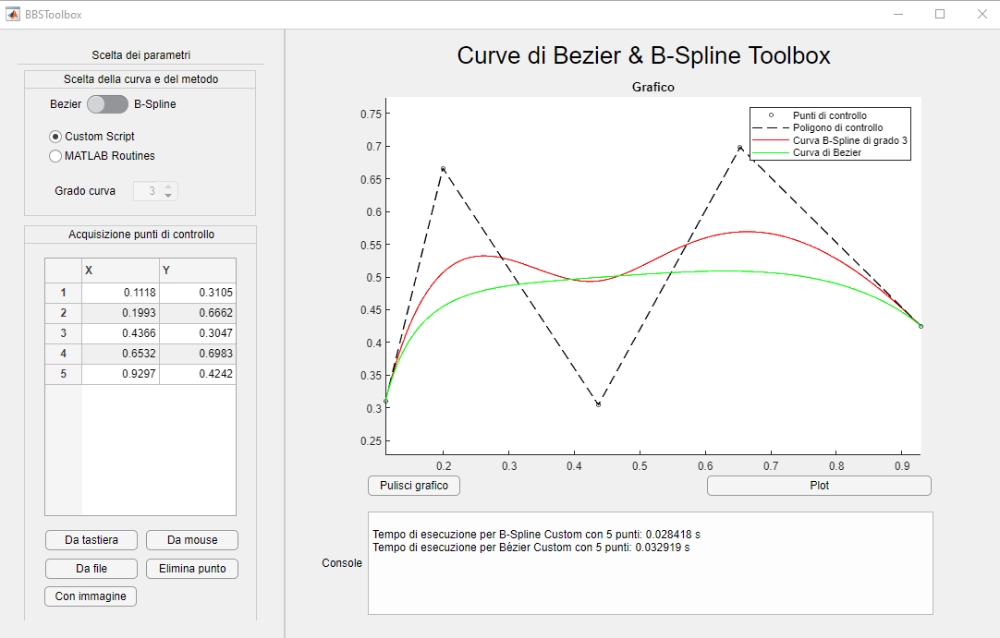

# Bezier - Bspline Tool
Matlab add-on toolbox for creating and evaluating bezier and b-spline curves.

This toolbox is installable in Matlab and provides a user friendly UI to work with spline curves or bezier.
It allows the fitting of curves from a list of points in cartesian coordinates or points taken by mouse.

 
